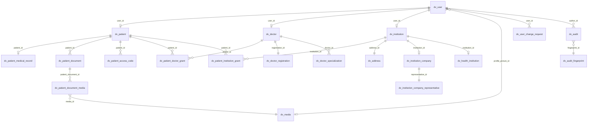

# Banco de dados

Modelagem, tabelas, relações, migrations e operação do PostgreSQL usado pelo back-end (branch `develop`). O banco é relacional, acessado por TypeORM; Redis e MinIO também existem, mas guardam dados temporários/arquivos (ver [Outros armazenamentos](#outros-armazenamentos)).

## Sumário

- [Padrões de modelagem](#padrões-de-modelagem)
- [Dados pessoais criptografados](#dados-pessoais-criptografados)
- [Exceções e divergências](#exceções-e-divergências)
- [Visão geral das tabelas](#visão-geral-das-tabelas)
- [Tabelas transversais](#tabelas-transversais)
- [Diagrama das relações principais](#diagrama-das-relações-principais)
- [Enums persistidos](#enums-persistidos)
- [Migrations: fluxo e regras](#migrations-fluxo-e-regras)
- [Comandos](#comandos)
- [Seeds e dados de base](#seeds-e-dados-de-base)
- [Backup e restauração](#backup-e-restauração)
- [Outros armazenamentos](#outros-armazenamentos)
- [Pontos de atenção](#pontos-de-atenção)

## Padrões de modelagem

Fonte: [base.entity.ts](../dr-hugo-back-end/src/core/base/base.entity.ts) e as migrations em [src/core/config/database/migrations](../dr-hugo-back-end/src/core/config/database/migrations).

| Tema | Padrão |
|---|---|
| Prefixo | Tabelas começam com `dv_` (ex.: `dv_user`). Tipos enum **não** têm prefixo (`user_role_enum`). |
| Nomes | Tabelas e colunas em `snake_case`, tabelas no singular. Dependentes usam o nome da principal como prefixo (`dv_doctor_specialization`, `dv_patient_document_media`). |
| Chave primária | `id uuid`, default `uuid_generate_v4()` (maioria) ou `gen_random_uuid()` (tabelas de vínculo). |
| Colunas de linha | Toda tabela tem `is_active boolean default true`, `created_at`, `updated_at` (nulo até a primeira alteração) e `deleted_at`. |
| Remoção | **Soft delete** por `deleted_at` (as consultas do `BaseRepository` ignoram removidos). Alguns fluxos fazem `DELETE` físico (tokens, mídias temporárias, códigos e solicitações expirados). Vínculos (grants) usam `revoked_at`. |
| Ativo x removido | `is_active` indica conta/registro ativo (usuário só fica ativo após confirmar o e-mail); `deleted_at` indica remoção. São independentes. |
| Chaves estrangeiras | `<entidade>_id`. Nomes variam: `FK_dv_<tabela>_<referência>` na maioria; `fk_patient_doctor_grant_*` (minúsculas) nos vínculos; `FK_health_institution_institution` sem `dv_`. A maioria é `ON DELETE CASCADE`; foto de perfil e autor da auditoria, `SET NULL`; **vínculos (grants) e solicitações de troca não têm cascade** (`NO ACTION`). |
| Constraints/índices | `UQ_<tabela>_<colunas>`, `IDX_<tabela>_<colunas>`. A `develop` adicionou índices em auditoria, documentos, perfis e vínculos (commit `d5108ae`). |
| Enums | Tipos `ENUM` nativos do PostgreSQL com os **valores** do enum TypeScript (inclusive rótulos em português, como `'Suspensão parcial permanente'`). Gênero é `varchar(10)`. |
| Escalas numéricas | **Não há** colunas `decimal/numeric/float`. Só `integer` (tamanho de mídia, ordem). |
| Arrays e JSON | `text[]` (`documents_ids`), `jsonb` (termos aceitos), `json` (atividades da empresa). |

## Dados pessoais criptografados

Na `develop`, dados pessoais ficam **criptografados** (AES-256-GCM, chave `CRYPTO_KEY`) e a busca é feita por **hash HMAC-SHA256** da mesma chave:

| Tabela | Colunas criptografadas (`text`) | Colunas de hash (busca/unicidade) |
|---|---|---|
| `dv_user` | `email`, `tax_id`, `phone`, `api_key` | `email_hash`, `tax_id_hash`, `phone_hash`, `api_key_hash` |
| `dv_institution_company_representative` | `name`, `tax_id` | — |
| `dv_address` | `street`, `number`, `complement`, `neighborhood`, `city`, `zip_code` | — |
| `dv_user_change_request` | `new_value` | — |
| `dv_patient_medical_record` | `physical_activity_types`, `weekly_frequency`, `blood_pressure`, `cigarettes_per_day`, `years_smoking` (e possivelmente as descrições; ver `medical-record.mapper.ts`) | — |
| `dv_audit` | `data` | — |
| `dv_audit_fingerprint` | `ip_address` | `fingerprint_hash` |

Consequências:

- ⚠️ **Não é possível consultar `dv_user` por e-mail/CPF/telefone com SQL comum**; é preciso calcular o HMAC com a mesma `CRYPTO_KEY`.
- ⚠️ Trocar `CRYPTO_KEY` num banco com dados inutiliza login e leitura desses campos. Faça backup da chave junto com o backup do banco.
- Unicidade de usuário: `UNIQUE (email_hash, role)`, `(tax_id_hash, role)`, `(phone_hash, role)` e `api_key_hash`.

## Exceções e divergências

⚠️ Itens observados na leitura; vale o que está efetivamente no banco de cada ambiente.

| Item | Detalhe |
|---|---|
| Migrations reorganizadas | Em 30/03/2026 (commit `5f2b183`) todo o histórico foi substituído por migrations pensadas para banco vazio. Um banco de desenvolvimento criado pelas migrations antigas não corresponde ao novo histórico (nomes de migration diferentes, colunas como `"taxId"` renomeadas para `tax_id`, dados agora criptografados). O banco de produção foi gerado do zero com as migrations atuais. |
| Nomes de FK e UUID | Convenções misturadas entre as tabelas antigas e as de vínculo (ver tabela acima). |
| Nomes de tipos enum | As migrations criam `user_role_enum` etc.; sem `enumName` nas entidades, o TypeORM esperaria `dv_<tabela>_<coluna>_enum`. Na prática não afeta consultas, mas `migration:generate` pode gerar diferenças espúrias. |
| Extensão `uuid-ossp` | As migrations usam `uuid_generate_v4()` e não contêm `CREATE EXTENSION`. O TypeORM costuma instalar a extensão ao conectar no PostgreSQL quando há colunas `uuid` (comportamento do framework, não verificado neste projeto); o usuário do banco precisa de permissão. |
| `dv_patient_access_code` | Reescrita: agora tem `role`, `documents_ids`, `persistent`, `allow_access_to_all_documents` (a coluna `used_at` da versão antiga foi removida). |

## Visão geral das tabelas

22 tabelas, todas criadas por migrations.

| Assunto | Tabela | Conteúdo |
|---|---|---|
| Usuários | `dv_user` | Conta de todos os perfis: nome, e-mail/CPF-CNPJ/telefone (criptografados + hashes), senha (bcrypt), país, `role`, `is_valid`, termos aceitos, API key, foto |
| | `dv_user_change_request` | Pedidos de troca de e-mail/telefone (`type`, `new_value`, `status`, `expires_at`) |
| Pacientes | `dv_patient` | Paciente (usuário + data de nascimento + gênero) |
| | `dv_patient_medical_record` | Ficha médica (1 por paciente; flags `has_*` + descrições em `text`) |
| | `dv_patient_document` | Documento médico (tipo, datas, `tuss_code`/`tuss_category`, solicitante, local, observações) |
| | `dv_patient_document_media` | Arquivos de um documento (`media_id`, `is_primary`, `order`) |
| | `dv_patient_access_code` | Códigos temporários de acesso (único, expira, `used`, destinatário, documentos, permanente) |
| Vínculos | `dv_patient_doctor_grant` | Permissão do paciente a um médico (documentos liberados, `persistent`, `revoked_at`, curtidas, `allow_access_to_all_documents[_at]`) |
| | `dv_patient_institution_grant` | Idem para instituição |
| Médicos | `dv_doctor` | Médico (usuário, nascimento, gênero, `is_generalist`) |
| | `dv_doctor_registration` | Registro no CFM (CRM único, situação, tipo, UF, última atualização) |
| | `dv_doctor_specialization` | Especializações (nome + RQE) |
| Instituições | `dv_institution` | Instituição (usuário, endereço, CNES, tipo) |
| | `dv_institution_company` | Dados da empresa (CNPJ/ReceitaWS) |
| | `dv_institution_company_representative` | Representante legal |
| | `dv_health_institution` | Dados do estabelecimento de saúde (CNES): natureza, centros cirúrgico/obstétrico/neonatal, atendimentos, códigos de unidade |
| | `dv_address` | Endereço |
| Arquivos | `dv_media` | Metadados de arquivos no MinIO, incluindo `owner_user_id` |
| Domínio | `dv_tuus_category` | Procedimentos TUSS (`tuss_code` único, nome, categoria) importados de CSV |
| Segurança/Rastro | `dv_token` | Códigos de uso único (6 dígitos + hash) |
| | `dv_audit` | Eventos de auditoria (`data` criptografado) |
| | `dv_audit_fingerprint` | Impressão digital do cliente (IP criptografado, hash, user-agent, sessão) |

## Tabelas transversais

| Tabela | Por que é transversal |
|---|---|
| `dv_user` | Base de **todos** os perfis; `dv_patient`, `dv_doctor` e `dv_institution` apontam para ela (`CASCADE`). Também é autora em `dv_audit`, dona de `dv_user_change_request` e de `dv_media` (`owner_user_id`). |
| `dv_media` | Foto de perfil (`dv_user.profile_picture_id`) e arquivos de documentos (`dv_patient_document_media`, `CASCADE`). Reflete objetos no MinIO e define quem é dono do arquivo. |
| `dv_patient` | Centro dos dados de saúde: ficha, documentos, códigos de acesso e vínculos apontam para ele. |
| `dv_token` | Serve a confirmação de e-mail, recuperação de senha e troca de e-mail/telefone. Não tem FK: liga-se por `identification` (texto, p. ex. `email:perfil`). |
| `dv_audit` / `dv_audit_fingerprint` | Gravadas pelo `AuditInterceptor` em qualquer rota com `@Auditable`. |
| `dv_tuus_category` | Alimenta sugestões de descrição e classificação de documentos (`tuss_code`, `tuss_category`). |

## Diagrama das relações principais



*(Cardinalidades conforme as migrations. `dv_token` e `dv_tuus_category` não têm FK. `documents_ids` nos vínculos e códigos é um array de IDs de documentos sem FK.)*

## Enums persistidos

| Tipo no banco | Valores | Enum no código |
|---|---|---|
| `user_role_enum` | ADMIN, PATIENT, DOCTOR, INSTITUTION | `UserRole` |
| `institutional_user_role_enum` | DOCTOR, INSTITUTION | `InstitutionalUserRole` |
| `token_type_enum` | PASSWORD_RESET, EMAIL_CONFIRMATION, USER_REQUEST_CHANGE | `TokenType` |
| `media_type_enum` | PNG, JPG, JPEG, GIF, PDF, DOCX, DOC, XLSX, XLS, PPTX, PPT, TXT, HTML, CSV, ODS, RAR, ZIP | `MediaType` |
| `audit_event_type_enum` | CREATE, UPDATE, DELETE | `AuditEventType` |
| `brazilian_state_enum` | as 27 UFs | `BrazilianState` |
| `doctor_situation_enum` | 17 situações do CRM | `DoctorSituation` |
| `doctor_registration_type_enum` | Principal, Secundária, Provisória, Temporária, Estudante estrangeiro | `DoctorRegistrationType` |
| `doctor_specialization_type_enum` | 55 especialidades do CFM (rótulos em português) | `DoctorSpecializationType` |
| `medical_institution_type_enum` | 13 tipos | `MedicalInstitutionType` |
| `company_type_enum` | Matriz, Filial | `CompanyType` |
| `user_change_request_type_enum` | EMAIL, PHONE | literal na entidade |
| `user_change_request_status_enum` | PENDING, CONFIRMED, EXPIRED | `UserChangeRequestStatus` |
| `patient_document_type_enum` | 8 rótulos em português (ex.: `Exame Laboratorial/Imagem`, `Receituário Médico / Prescrição`) | `PatientDocumentType` (agora alinhado com a migration) |
| (varchar) `gender` | Masculino, Feminino, Outro | `Gender` |

Alterar um enum exige migration (`ALTER TYPE ... ADD VALUE`, como em `AddMissingMediaTypeEnumValues`) **e** atualizar o enum TypeScript. Valores adicionados a um enum PostgreSQL não são removidos facilmente.

## Migrations: fluxo e regras

Histórico atual (8 migrations):

| Migration | Conteúdo |
|---|---|
| `1769103067723-CreateCoreDomainTables` | Enums base; `dv_media`, `dv_address`, `dv_token`, `dv_audit_fingerprint`, `dv_audit`, `dv_tuus_category` |
| `1769200000000-CreateMainEntityTables` | `dv_user`, `dv_patient`, médicos, instituições, `dv_health_institution`, `dv_user_change_request` e seus enums |
| `1770396013261-CreateMedicalRecordTable` | `dv_patient_medical_record` |
| `1770500000000-CreatePatientDocumentTable` | `dv_patient_document`, `dv_patient_document_media`, enum de tipo |
| `1770600000000-CreatePatientAccessCodeTable` | `dv_patient_access_code`, `institutional_user_role_enum` |
| `1774316466050-CreatePatientAccessGrantRelatedTables` | `dv_patient_doctor_grant`, `dv_patient_institution_grant` |
| `1774316466051-AddAllowAccessToAllDocumentsAtToDoctorGrant` | coluna `allow_access_to_all_documents_at` |
| `1774316466052-AddMissingMediaTypeEnumValues` | CSV, ODS, RAR, ZIP em `media_type_enum` |

Fluxo para alterar o esquema:

1. Altere/crie a entidade (`*.entity.ts`).
2. Gere a migration (`npm run migration:generate -- src/core/config/database/migrations/<Nome>`) **ou** escreva à mão (`migration:create`). Padrão: SQL explícito em `queryRunner.query`. **Revise o SQL gerado.**
3. Escreva um `down` que realmente reverta.
4. Aplique localmente: `npm run migration:run`.
5. A migration chega à produção junto com o deploy, mas **não é aplicada automaticamente** (ver [DEPLOY.md](DEPLOY.md#migrations-em-produção)).

Regras:

- `synchronize` é `false`: o esquema só muda por migration.
- A API **não aplica migrations ao iniciar**.
- Nunca edite nem reorganize migrations já aplicadas em algum ambiente (a reorganização de 30/03/2026 foi feita antes da versão 1.0.0 de produção, gerada do zero).
- Nomes: `<timestamp>-<Descricao>.ts`, classe `<Descricao><timestamp>`. Observe que as migrations reorganizadas usam timestamps antigos (1769…); migrations novas devem ter timestamp **maior** que a última aplicada.

## Comandos

Rode dentro de `dr-hugo-back-end/` (usam o `.env`):

| Comando | O que faz | Risco |
|---|---|---|
| `npm run migration:run` | Aplica migrations pendentes | Médio (altera esquema) |
| `npm run migration:revert` | Desfaz a última migration | ⚠️ Pode apagar dados |
| `npm run migration:generate -- <caminho>` | Compara entidades x banco e gera migration | Baixo |
| `npm run migration:create -- <caminho>` | Cria migration vazia | Baixo |
| `npm run schema:log` | Mostra o SQL que o `sync` executaria | Baixo |
| `npm run schema:sync` | Força o esquema a ficar igual às entidades | ⚠️ Ignora migrations |
| `npm run schema:drop` | **Apaga todo o esquema** | ⚠️⚠️ Destrutivo |

⚠️ Antes de qualquer comando acima, confira `DATABASE_HOST` no `.env`.

## Seeds e dados de base

- **Não há seeds** de usuários nem migrations de dados.
- `dv_tuus_category` é preenchida **automaticamente na inicialização** pela importação de [tuus-exams.csv](../dr-hugo-back-end/src/core/resources/tuus/tuus-exams.csv) (`TuusCategoryService.onModuleInit`, que lê `process.cwd()/src/core/resources/tuus/`; se o arquivo não existir, apenas registra aviso).
- As demais listas de apoio vêm de **enums no código**; países e termos legais, de arquivos em `src/core/resources/`.
- Para dados de desenvolvimento, veja [EXECUCAO_LOCAL.md](EXECUCAO_LOCAL.md#migrations-e-dados-de-desenvolvimento).

## Backup e restauração

O repositório **não define** rotina de backup. Procedimentos genéricos do PostgreSQL, neutros em relação ao SO:

```bash
# Backup (formato custom, compactado)
pg_dump -h <host> -p <porta> -U <usuario> -d <banco> -Fc -f backup.dump

# Restauração em um banco já criado e vazio
pg_restore -h <host> -p <porta> -U <usuario> -d <banco_destino> --no-owner backup.dump
```

- **Local (container):** `docker exec -t postgres pg_dump -U <usuario> -d <banco> -Fc > backup.dump` (nome do container no compose: `postgres`).
- **Produção:** o banco roda como container no Coolify e **não é exposto fora da rede interna** ([COOLIFY.md](COOLIFY.md)). Não há backup configurado.
- Um backup só é útil com a **`CRYPTO_KEY` correspondente** guardada com segurança.

⚠️ **Dados pessoais e de saúde:** um dump contém dados sensíveis de pacientes e médicos (LGPD). Mesmo com campos criptografados, restos como nomes, datas e descrições de documentos ficam legíveis. Não restaure em desenvolvimento sem anonimizar e não envie o arquivo por canais comuns.

## Outros armazenamentos

| Sistema | Uso | Observação |
|---|---|---|
| Redis | Cache; chaves de resolução (`resolution:<64 hex>`, 24 h, e 5 min para QR); validações de CRM/CNES/CNPJ (1 h); cache TUSS | Efêmero: perder o Redis invalida links e consultas em andamento |
| MinIO | Arquivos. Buckets `temp`, `users`, `patient-documents` | `dv_media` guarda `bucket`, `object_name` e `owner_user_id` |

## Pontos de atenção

- `dv_media` só aponta para o objeto; apagar a linha **não** apaga o arquivo e vice-versa (o código faz as duas coisas em sequência).
- Arquivos em `temp` com mais de 1 dia são apagados pela rotina horária, junto com a linha de `dv_media` (e, por `CASCADE`, com a ligação em `dv_patient_document_media`). Por isso o fluxo de documentos move os arquivos para o bucket `patient-documents` ao salvar.
- O hash de senha fica em `dv_user.password` (bcrypt); nunca é devolvido pela API.
- Há `ON DELETE CASCADE` em cadeia (usuário → perfil → ficha/documentos…): um `DELETE` físico em `dv_user` remove muita coisa, enquanto os vínculos (grants) **bloqueiam** a remoção do paciente/médico/instituição.
- Não é sempre o banco que criptografa: a criptografia é feita **nos mappers/services** (aplicação), então SQL direto ou `migration` de dados precisa respeitar isso.
- `dv_token.identification` guarda e-mails em texto (formato `email:perfil`).
- Limpezas automáticas (tokens, códigos, solicitações, mídias temporárias, vínculos) rodam por `@Cron`; ver [INTEGRACOES.md](INTEGRACOES.md#tarefas-agendadas).
